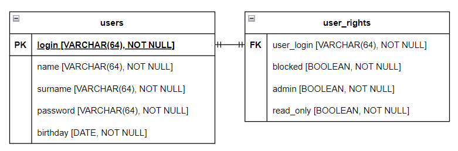

____________________________________________________________________________________________________

#"Приложение для взаимодействия с БД хранящей список пользователей, и их прав для работы с приложением."

## Requiments/description

### Overview

asyncio
Web REST aiohttp
БД PostgreSQL с валидацией, схема и миграции Alembic. SQL Alchemy core ~1.4

Аутентификация и авторизация на aiohttp-security:
- кастомные уровни доступа
- пароли через bcrypt (авто соль)
- куки сессия
Валидация моделей запросов и ответов с Pydantic
Логи
OpenAPI документация Эндпоинтов и форм (Swagger)

### Req list

DATABASE: 
- [v] Схема таблицы пользователей (Имя, Фамилия, Логин, Пароль, Дата Рождения) 
- [v] Схема таблицы прав пользователей (Логин, Блокировка, Администратор, Только чтение)
ВАЖНО: 
- [v] У 1 пользователя может быть или только "Администатор" или "Только чтение"
- [v] Изначально должен быть заведен 1 пользователь с правами Администратора admin, admin, admin, 01-01-1970
Будет + 
- [v] если будет подключена миграция череp ALEMBIC

BACKEND:
- [v] Запрос авторизации по логину и паролю.
- [v] Разработать CRUD (CREATE, READ, UPDATE, DELETE) на таблицу пользователей.

Требование к BACKEND
- [v] Логирование
- [v] доступ к этому API CRUD только после авторизации
- [v] Соответственно Администраторы могут полный CRUD 
- [v] "Только Чтение" могут только READ Для остальный методов forbidden/unauthorized
- [v] Никакого Фронта не нужно. Общение только посредствам REST API

Будет огромный +: 
1. [v] Cформированая документация swagger и доступ по url backend
2. [~] Использование Docker, docker-compose, Makefile
3. [v] Автотестирование (Pytest) routes backend желательно

Обязательный стэк
- [v] BACKEND aiohttp, asyncio
- [v 1.4 core only] DataBase postgresql + SQlAlchemy > 1.4 (Желательно CORE, но и ORM тоже можно)

____________________________________________________________________________________________________

## Prep

В папке конфиг задаем хосты и порты (lodalhost default)
- для приложения
- для базы 

## Run

docker run --rm -it -d -e POSTGRES_USER=admin -e POSTGRES_PASSWORD=admin -p 5432:5432 postgres

для создания таблиц и населения админа:
- "alembic upgrade head"
- (ну или без алембика напрямую -> .src/database/populate_db.py)

Точка входа - .src/main.py 

## Info

Таблица маршрутов в корне сайта ('/')

Документация (swagger для тестов) на ('/docs')

## File Desc
database/db:
- инициализация самой дб
- все CRUD для работы с бзаой
database/db_schema:
- мета модель базы для алхимии
database/db_authorization:
- реализация работы aiohttp-security через перегрузку абстрактных классов
database/db_population:
- первичная подготовка дб для работы с приложением

models/models:
- модель пользователя для валидации
- модель авторизации -//-

form_validation:
- валидация формы логина

openapi_doc:
- файл-описание апи для док уи

security:
- реализация работы с паролем (изолирована, легко заменить дургой библиотекой)

settings:
- конфиг и его загрузка

views:
(пожалуй правильнее было бы назвать хэндлы)
- реализация интерфейсов для веб 

Пара тестов на хендлы фронта
Пара тестов на crud

# Некрасивости ( TODO )
- Не ловятся эскепшны (наделать try)
- Нет тайпхинта
- Мб скорректировать респонсы
- Docker (поднимаю композ, бд норм, а апп постоянно  Connect call failed, mb bridge?)
